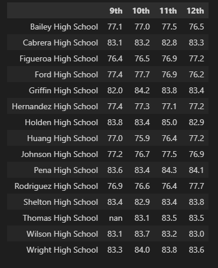
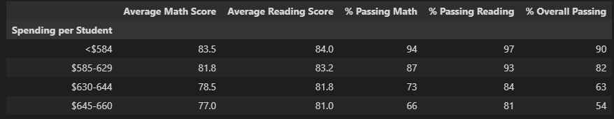

# School_District_Analysis

## Overview

- The purpose of this analysis is to investigate the potential of academic dishonesty as the reading and math grades for Thomas High School ninth graders appear to have been altered.
- The goal of this analysis is to replace the math and reading scores for Thomas High School with NaNs while keeping the rest of the data intact.
- Then the goal is to compare and contrast the two dataframes to check for any evidence of academic dishonesty.

## Results

- Despite replacing the 461 math and reading scores values for all 9th graders at Thomas High School with NaN, we found only a minor change in the mean of our dataframe.
    - Reading scores went from 81.87784 to 81.855796, a change of only 0.022044 points.
    - Math scores went from 78.985371 to 78.930533, a change of only 0.054838 points.

### School District Summary

- As seen in the image below, the school district summary saw average math scores dropping .1 points, and no change to the average reading scores. The overall percentage was reduced by 1%

### School Summary

- Looking at the school summary dataframe, as well as the top and bottom performing schools, we can see that replacing math and reading scores for ninth graders at THS had an impact on the rank of the school.

    - Thomas High School had a 91% overall passing, but after replacing math and reading scores, Thomas High School was taken out of the top five category since they now display a 65% overall passing.

    - The school ranks as 8 of 15 on the revised summary.

#### Top 5

#### Bottom 5

#### Average Math Scores by Grade & School

#### Average Reading Scores by Grade & School

- We can clealy see from the two images above that only the math and reading scores at Thomas High School were manipulated, and the rest of the scores across the other fourteen schools remains in tact.

### School Spending Summary

- The school spending summary shows us the data we manipulated did not impact the spending ranges for math or reading scores.  The spending ranges for the various passing percentages.

- The image below shows there was a 6% decrease in % passing math, a 7% decrease in % passing reading, and a 6% decrease in % overall passing in the $630-644 spending range.

### School Size Summary

- Given the fact that Thomas High School has a student population of 1,635. It makes sense that the small and large school averages were not impacted by replacing the math and reading scores at THS.

- The medium population schools saw % passing math, % passing reading, and % overall passing dropped 6% each.

### School Type Summary

- Changing the ninth grade scores at THS also affected the passing percentages when comparing charter and district schools. However, the average scores for the two school types were not affected.

- Charter schools initially saw scores of 94% passing math, 97% passing reading, 90% overall passing.

- After replacing the ninth grade scores we see 90% passing math, 93% passing reading, 87% overall passing.